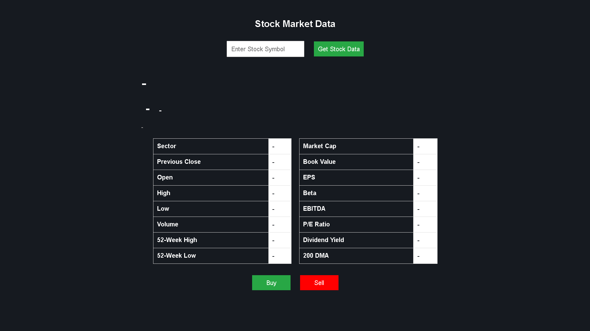

# 📈 Stock Tracker Dashboard

[](https://module-projects-qqz9b9vms-ashs-projects-d9fb2fd8.vercel.app/)
[](https://github.com/Ash-dot-coder/Module-Projects/tree/work/Re-MCT/M3-M4/StockTracker-Dashboard)

> A powerful and responsive **Stock Tracker Dashboard** that allows users to fetch, explore, and visualize real-time stock data using APIs and dynamic UI.

---

## 🧠 Key Highlights

* 🔍 **Search & View Stock Data**
  Users can search for any stock (e.g., AAPL, MSFT) by symbol and view real-time price, volume, and daily change stats.

* 📊 **Graphical Trend Visualization**
  Displays stock price trends over time using a dynamic, interactive line chart.

* 🔥 **Trending Stocks Dropdown**
  A dropdown menu shows the top 10 trending stocks. Selecting any stock auto-fills data and renders graphs accordingly.

* 🧾 **Stock Comparison Table**
  A dynamic table that compares selected stocks on key metrics like price, change %, and volume.

* 🌐 **Fully Responsive UI**
  Works seamlessly across desktops, tablets, and mobile devices.

---

## 🛠️ Technologies Used

* ✅ **HTML5** – Semantic structure
* ✅ **CSS3** – Modern styling with responsiveness
* ✅ **JavaScript** – DOM manipulation & event handling
* ✅ **Fetch API** – For making asynchronous API requests
* ✅ **Chart.js** – Graphical visualization of stock trends
* ✅ **Alpha Vantage API** – Real-time financial data provider

---

## 🚀 Project Features

| Feature                     | Description                                               |
| --------------------------- | --------------------------------------------------------- |
| 🔎 Stock Search             | Enter a stock symbol to fetch and display live data       |
| 📉 Price Trend Graph        | Uses Chart.js to visualize stock’s historical performance |
| 🔝 Trending Stocks Dropdown | Select from top 10 trending stocks instantly              |
| 📋 Comparison Table         | View and compare stock price, volume & changes            |
| ⚡ Real-Time API Integration | Retrieves financial data via Alpha Vantage API            |
| 📱 Responsive Design        | Works across mobile, tablet, and desktop                  |

---

## 📦 Folder Structure

```
StockTracker-Dashboard/
│
├── index.html               # Main file
├── style.css                # Styles and layout
├── script.js                # JavaScript logic (API, DOM, Events)
├── assets/                  # Images and other media
├── README.md                # You're here!
```

---

## 🖼️ Output Screenshots



> *Replace the above placeholder URLs with your actual screenshots once uploaded.*

---

## 🧪 Getting Started

### ✅ Prerequisites

* Modern Web Browser (Chrome, Firefox, Edge)
* Internet connection to load stock data from API

### 📂 Installation Steps

1. **Clone the repository**

   ```bash
   git clone https://github.com/Ash-dot-coder/Module-Projects.git
   ```

2. **Navigate to the project directory**

   ```bash
   cd Module-Projects/Re-MCT/M3-M4/StockTracker-Dashboard
   ```

3. **Open `index.html` in your browser**

---

## 📚 Resources & Docs

* [📘 Alpha Vantage API](https://www.alphavantage.co/documentation/) – Real-time stock data provider
* [📗 Chart.js](https://www.chartjs.org/docs/latest/) – Graph rendering library

---

## 🧠 Learning Goals

✅ Build real-world stock applications using external APIs
✅ Practice working with JSON data and asynchronous fetch requests
✅ Master dynamic DOM manipulation
✅ Design responsive UIs with real-time updates
✅ Learn to visualize financial data in graphs

---

## 📜 License

This project is licensed under the [MIT License](LICENSE).

---

## 🙌 Acknowledgements

* 🔗 [Alpha Vantage](https://www.alphavantage.co/)
* 📊 [Chart.js](https://www.chartjs.org/)
* 🎨 [Font Awesome](https://fontawesome.com/) – Icons used (if applicable)

---